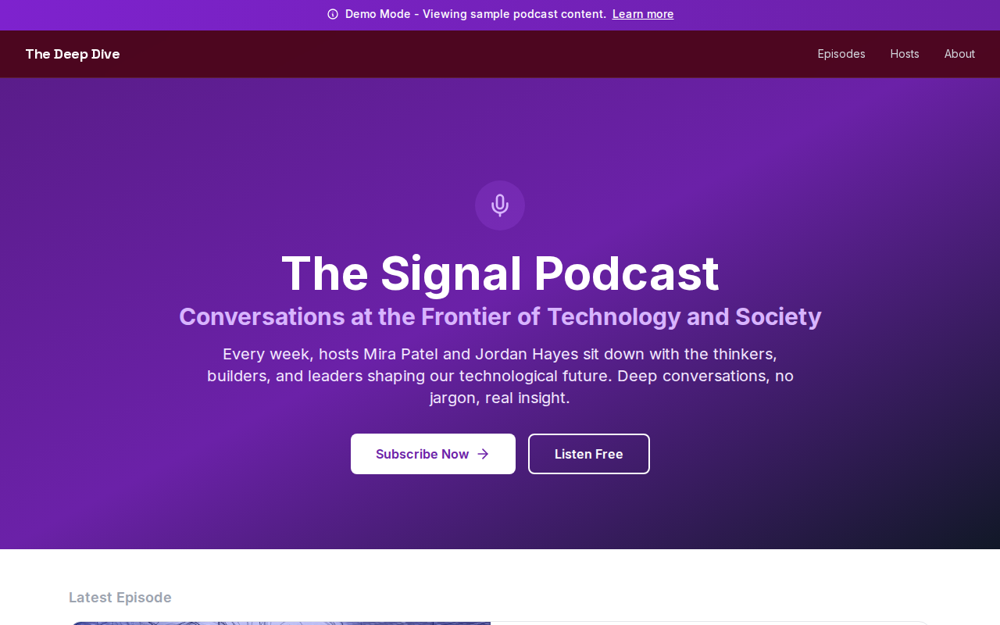

# Decoupled Podcast

A podcast website built with Next.js and Drupal (via Decoupled.io). Features episode listings, host profiles, and a modern dark UI designed for audio content.



## Features

- **Episode Listings**: Browse and filter podcast episodes
- **Host Profiles**: Dedicated pages for podcast hosts
- **Decoupled Drupal**: Content management via Decoupled.io with GraphQL API
- **Dark UI**: Modern podcast-focused interface with Tailwind CSS
- **Demo Mode**: Fully functional preview with mock data -- no backend required
- **TypeScript**: Fully typed for better developer experience

## Quick Start

### 1. Install & Setup

```bash
npm install
npm run setup
```

The interactive setup script guides you through creating a Drupal space and importing sample content.

### 2. Start Development Server

```bash
npm run dev
```

Open [http://localhost:3000](http://localhost:3000) to see your site.

### Demo Mode

To run without any backend:

```bash
NEXT_PUBLIC_DEMO_MODE=true npm run dev
```

## Environment Variables

| Variable | Description | Required |
|----------|-------------|----------|
| `DRUPAL_BASE_URL` | Your Drupal space URL | Yes |
| `DRUPAL_CLIENT_ID` | OAuth client ID | Yes |
| `DRUPAL_CLIENT_SECRET` | OAuth client secret | Yes |
| `NEXT_PUBLIC_DEMO_MODE` | Enable demo mode (`true`) | Optional |

## Project Structure

```
decoupled-podcast/
├── app/
│   ├── api/graphql/           # Drupal GraphQL proxy
│   ├── components/
│   │   ├── Header.tsx
│   │   ├── Footer.tsx
│   │   ├── EpisodeCard.tsx    # Episode listing cards
│   │   ├── HostCard.tsx       # Host profile cards
│   │   ├── HeroSection.tsx
│   │   └── CTASection.tsx
│   ├── episodes/page.tsx      # Episode listing
│   ├── hosts/page.tsx         # Host profiles
│   └── [...slug]/page.tsx     # Dynamic routing
├── lib/
│   ├── apollo-client.ts       # GraphQL client
│   ├── queries.ts             # GraphQL queries
│   └── types.ts
└── data/
    └── mock/                  # Demo mode mock data
```

## Commands

| Command | Description |
|---------|-------------|
| `npm run dev` | Start development server |
| `npm run build` | Build for production |
| `npm run setup` | Interactive setup wizard |
| `npm run setup-content` | Import sample content |

## Deployment

1. Push to GitHub
2. Import in Vercel
3. Add environment variables
4. Deploy

Set `NEXT_PUBLIC_DEMO_MODE=true` for a demo deployment without backends.

## License

MIT
